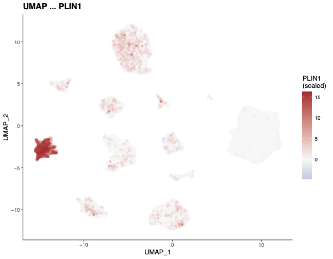
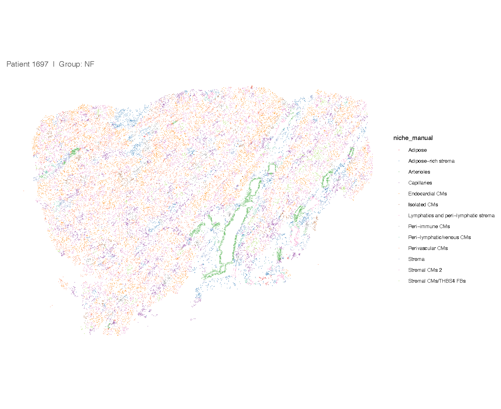

# RV_Atlas

**Human Adult and Pediatric Single-Nucleus Transcriptomic Atlas of Progression from Pressure Loaded to Failing Right Ventricle**

*Kuznetsov IA, Li K, Guedira Y, Simonson B, Chaffin M, Bedi KC Jr., Thome T, Zhao W, Zhu W, Zhou W, Yang Y, Kadyrov F, Amrute JM, Lai L, Griffin J, Li L, Li J, Miyamoto SD, Ellinor P, Margulies KB, Lavine KJ, Arany Z\*, Edwards JJ\**

---

## About

This repository contains the R analysis code used to generate all figures in the manuscript. The paper characterizes the transcriptional landscape of healthy, pressure-overloaded, and failing human right ventricles (RVs) using a multi-modal approach: bulk RNA-seq (n=142), single-nucleus RNA-seq (snRNA-seq; n=11 adult, n=14 pediatric), and spatial transcriptomics (10X Xenium). Key findings include:

- **Cardiomyocytes** downregulate nuclear-encoded mitochondrial transcripts and show reduced mitochondrial respiration in RV failure (RVF)
- **Myeloid cells** upregulate MHCII-associated genes, indicating a shift toward antigen presentation and a pro-inflammatory state in RVF
- **Endothelial cells** expand in RVF, driven by capillary and arterial subtypes in adults and venous subtypes in pediatric hearts — an expansion not seen in left ventricular failure
- A murine pulmonary artery-banding (PAB) model of RVF recapitulates EC expansion but diverges from human RVF in myeloid and cardiomyocyte transcriptional programs, cautioning against its uncritical use
- Pediatric RVF (hypoplastic left heart syndrome) largely mirrors adult RVF transcriptionally, with notable differences in mitochondrial and endothelial programs

## Repository purpose

This repository enables reproduction of all publication figures (`Figure_1.R` – `Figure_8.R`) and supplementary figures (`Supplementary_Figure_1.R` – `Supplementary_Figure_8.r`). Each script is self-contained and reads processed data objects from the `./dependencies/` directory.

---

### PREPROCESSING PIPELINE ###

Raw CellBender-corrected H5 files are processed through a four-step pipeline in `preprocess_pipeline/` before figure generation. Steps must be run in order; each saves intermediate `.rds` files to `./output/`.

**STEP1_Preprocess.R** — Per-sample QC, doublet scoring, and initial clustering
Reads CellBender H5 files from `./dependencies/CellBender_Final/`. For each of the 11 adult samples (1343, 1392, 1467, 1561, 1567, 1618, 1632, 1681, 1691, 1692, 1697) it:
- Assigns disease group labels: NF (non-failing), pRV (pressure-overloaded RV), or RVF (RV failure)
- Computes per-nuclei QC metrics: mitochondrial fraction (`percent.mt`), exonic fraction (`percent.exon`), and transcriptional entropy using `scrinvex` output and the `ndd` Python library
- Scores doublets using Scrublet (via `reticulate`; requires the `scrublet` conda environment)
- Clusters each sample individually and removes low-quality nuclei using IQR-based outlier thresholds on `percent.mt`, `percent.exon`, and entropy — applied per cluster
- Applies a second outlier-removal pass using sklearn's `EllipticEnvelope` (contamination = 0.05) on the three QC metrics jointly
- Applies hard cutoffs: `nFeature_RNA > 200`, `percent.mt < 1`, `entropy > 5`, `percent.exon < 0.25`
- Outputs: `./output/dataset_post_clipping_qc.rds`

**STEP0_Integration.R** — Cross-sample integration with Harmony
Reads `./output/dataset_post_clipping_qc.rds`. For each sample applies SCTransform (regressing out `percent.mt`), PCA (80 PCs), and UMAP. Merges all 11 samples, selects 2,000 integration features, and runs Harmony batch correction on patient ID. Re-embeds with UMAP and Leiden clustering.
Outputs: `./output/BroadData_Harmony_SCTransform_with_Doublets.rds`

**STEP2_Doublet_removal.R** — Cell-type isolation and doublet purification
Reads the Harmony-integrated object. Iteratively extracts each of 12 cell types (CM, FB, EC, Endocardial, Adipo, Myeloid, SM, Neuron, Epicardial, LEC, PC, NKT, Proliferating) by their cluster identities, re-clusters each subset with SCTransform + Harmony, and removes contaminating nuclei identified by canonical marker expression (e.g., VWF for EC contamination in CMs, DCN for fibroblast contamination). A second round of refinement is performed after merging all clean cells. The process runs for three rounds total, with manual cell selection (`CellSelector`) used for fine-grained cleanup in round 2.
Outputs per cell type to `./output/CellTypes/` and final cleaned object to `./output/CellTypes/integrated_no_doublets.rds`

**STEP3_Decontaminate_ambient.R** — Ambient RNA removal and final integration
Reads `./output/CellTypes/integrated_no_doublets.rds`. Converts to SingleCellExperiment and runs `decontX` (from the `celda` package) with cell-type and patient-batch labels to model and remove ambient RNA contamination. The decontaminated count matrix is stored as a new `decontXcounts` assay. Samples are split, re-merged, and re-integrated with SCTransform + Harmony. A final three-round cell-type re-extraction and cleanup produces the publication-ready object.
Final output: `./output/Post_R3_FINAL.rds` (used as `./dependencies/shared/Post_R3_FINAL_with_counts.rds` by figure scripts)

---

### DEPENDENCIES ###

First create a conda enviornment:

conda create -n RV_atlas -c conda-forge -c bioconda r-base=4.4 mamba
conda activate RV_atlas

mamba install -c conda-forge -c bioconda r-seurat r-hdf5r r-igraph r-tidyverse r-ggraph r-harmony r-enrichr r-devtools r-cairo r-sf
mamba install -c conda-forge -c bioconda bioconductor-ucell bioconductor-genomicranges bioconductor-geneoverlap 

Then open R and run:

install.packages("BiocManager")  
BiocManager::install()  
BiocManager::install("WGCNA")  
BiocManager::install('EnsDb.Hsapiens.v86')  
BiocManager::install("edgeR")  
BiocManager::install('sva')  
BiocManager::install('DESeq2')  
BiocManager::install('scCustomize')  
BiocManager::install('tximport')  
BiocManager::install('tximportData')  
BiocManager::install("biomaRt")  
BiocManager::install("DESeq2")  
BiocManager::install("DOSE")  
BiocManager::install('EnhancedVolcano')  
BiocManager::install('Nebulosa')  
BiocManager::install('glmGamPoi')  

install.packages('arrow')  
install.packages('reticulate')  
install.packages('colormap')  
install.packages('cowplot')  
install.packages('forcats')  
install.packages('ggeasy')  
install.packages('ggfortify')  
install.packages('gplots')  
install.packages('viridis')  
install.packages('stringr')  
install.packages('ggpubr')  
install.packages('reshape2')  
install.packages('readxl')  
install.packages('RColorBrewer')  
install.packages('pracma')  
install.packages('patchwork')  
install.packages('matrixStats')  
install.packages('ashr')  
install.packages("ClusterR")  
install.packages('VennDiagram')  

devtools::install_github('smorabit/hdWGCNA', ref='dev')  
remotes::install_github('satijalab/seurat-wrappers')  
devtools::install_github('immunogenomics/presto')  
devtools::install_github('cole-trapnell-lab/monocle3')  

### VISUALIZATION ###

To quickly visualize single-nuclei gene-expression first make sure you have the dependencies folder downloaded.  

Then open R and run:  

shiny::runApp("shinyViz")

To quickly visualize Xenium gene-expression first make sure you have the dependencies folder downloaded.  

Then open R and run:  

shiny::runApp("XeniumExp")

---

### FIGURES ###

#### Main Figures

**Figure 1 — Bulk RNA-sequencing of human RVF** (`Figure_1.R`)
Characterizes the bulk transcriptional landscape of 142 human RV samples (NF/pRV/RVF) using PCA, WGCNA (29 modules), GO enrichment, and module eigengene comparisons. Highlights a non-monotonic gene expression pattern (genes decreasing from NF→pRV then increasing pRV→RVF) enriched for Reactome pathways. Key modules capture sarcomere, mitochondrial, and inflammatory biology.

**Figure 2 — Single-nucleus RNA-sequencing of human RVF** (`Figure_2.R`)
Presents the adult RV snRNA-seq atlas: UMAP of 12 cell populations, marker-based cluster annotation, cell-type frequency shifts by disease state (notably EC expansion from NF→RVF), and projection of bulk WGCNA module scores onto individual cell types and disease states.

**Figure 3 — Xenium-based spatial transcriptomics of human RVF** (`Figure_3.R`)
Maps 9 of the 12 snRNA-seq cell types onto Xenium spatial data. Shows spatial distribution of cell types and 14 distinct cardiac niches, niche composition by disease state (no significant differences), and a heatmap of the 50 most variable genes by cell type.

**Figure 4 — RV cardiomyocyte transcriptomics** (`Figure_4.R`)
Deep analysis of cardiomyocyte-specific WGCNA modules. Demonstrates downregulation of nuclear-encoded mitochondrial transcripts (Complex I subunits NDUFA12, NDUFA5, NDUFB9) and upregulation of cytoskeletal/sarcomeric programs in RVF. Validated by direct mitochondrial respirometry showing reduced ETC capacity. Spatially localizes NPPA/NPPB-expressing CM subpopulations.

**Figure 5 — RV vs LV cardiomyocyte comparison** (`Figure_5.R`)
Compares RV RVF transcriptional changes to LV DCM (Koenig et al. dataset). Shows conservation of mitochondrial module downregulation and M2 cytoskeletal upregulation across both ventricles, with notable divergence in the M12 module trend. PCA and DESeq2 pseudobulk analysis reveal residual RV–LV differences beyond shared disease programs.

**Figure 6 — Myeloid cell subclustering and analysis** (`Figure_6.R`)
Resolves 7 myeloid subtypes (resident macrophages, monocytes, DCs, inflammatory macrophages, TREM2+ macrophages). Shows a shift from resident macrophages toward monocytes and inflammatory macrophages in RVF. Identifies CIITA/MHCII upregulation (module M8) and glucocorticoid-responsive NR3C1 target gene downregulation (module M1) as key disease-associated transcriptional programs.

**Figure 7 — EC subclustering and analysis** (`Figure_7.R`)
Resolves 5 EC subtypes (arterial, capillary, venous, lymphatic, endocardial). Demonstrates capillary and arterial expansion in adult RVF. hdWGCNA identifies 7 EC modules; module M1 (capillary), M4 (arterial), and M7 (venous/endocardial) all increase with disease severity. MECOM is highlighted as upregulated with RVF across EC subtypes.

**Figure 8 — Pediatric single-ventricle (HLHS) snRNA-seq** (`Figure_8.R`)
Co-embeds pediatric HLHS and adult RV datasets, showing shared cell types and broadly conserved disease-associated transcriptional programs. Pediatric RVF largely mirrors adult RVF in cardiomyocyte mitochondrial downregulation and myeloid MHCII upregulation. Notable differences include venous (rather than capillary/arterial) EC expansion in HLHS and divergent MECOM and Notch signaling trends.

---

#### Supplementary Figures

**Figure S1 — Extended bulk RNA-seq data** (`Supplementary_Figure_1.R`)
Volcano plots, fold-change scatter plots, and GO enrichments for pRV vs RVF DEGs. Heatmaps of monotonically increasing and decreasing gene sets. Shows that DD (down-down) genes belong primarily to M1 (mitochondrial ribosome components) and UU (up-up) genes to M2/M3.

**Figure S2 — Cardiomyocyte subclustering** (`Supplementary_Figure_2.R`)
UMAP and marker dot plots for 10 CM subpopulations. Cluster frequency by disease state, GO enrichments per cluster, and Xenium spatial validation of CM subtype markers (NPPA, NPPB, MYH7, MYH6, ANKRD1).

**Figure S3 — RV vs LV myeloid and fibroblast comparison** (`Supplementary_Figure_3.R`)
Reference mapping of LV myeloid and fibroblast datasets onto the RV atlas. Validates concordance of macrophage/monocyte annotations across ventricles. Shows conservation of NR3C1-target and MHCII gene changes, and correlation of fibroblast RVF vs DCM fold changes.

**Figure S4 — Fibroblast, pericyte, and smooth muscle subclustering** (`Supplementary_Figure_4.R`)
UMAP and markers for 7 fibroblast subpopulations; myofibroblast activation markers increase from NF→RVF across subtypes. ChEA TF enrichments for up/downregulated DEGs. Pericyte/smooth muscle subpopulations and their disease-associated DEGs.

**Figure S5 — Mouse PAB RV snRNA-seq** (`Supplementary_Figure_5.R`)
snRNA-seq atlas of the murine pulmonary artery banding (PAB) model. EC expansion is recapitulated, but myeloid MHCII response is inverted (decreases with PAB, opposite to human RVF). Bulk RNA-seq of sorted cardiac macrophages validates the myeloid single-nuclei findings.

**Figure S6 — Mouse PAB RV cardiomyocytes** (`Supplementary_Figure_6.R`)
Reference mapping of mouse CM subtypes onto human RV subtypes — partial concordance. Human RVF mitochondrial transcript downregulation is not conserved in the mouse model. Scatter plots highlight poor fold-change correlation between species for CM genes. MitoCarta3.0-annotated genes are uniformly downregulated in human but not mouse RVF.

**Figure S7 — Extended pediatric HLHS data** (`Supplementary_Figure_7.R`)
Detailed myeloid and EC subclustering of the HLHS dataset. Myeloid: CIITA/NR3C1 enrichments conserved with adult; EC: venous expansion in HLHS contrasts with capillary/arterial expansion in adults. Divergent MECOM, Notch, SMAD1, and NR2F2 trends between adult and pediatric EC disease programs.

**Figure S8 — Non-failing adult vs pediatric RV comparison** (`Supplementary_Figure_8.r`)
Co-embedding of healthy adult and pediatric RVs. Compares cell type abundance, bulk WGCNA module scores, and pseudobulk cardiomyocyte DEGs between NF adult and NF pediatric samples, highlighting baseline transcriptional differences between age groups independent of disease.
