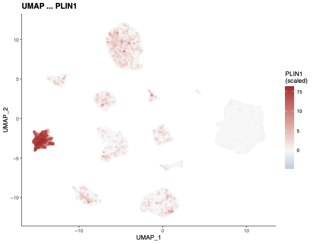
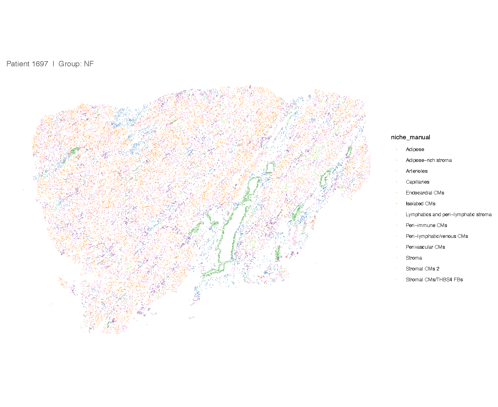

# RV_Atlas

**Human Adult and Pediatric Single-Nucleus Transcriptomic Atlas of Progression from Pressure Loaded to Failing Right Ventricle**

*Ivan A. Kuznetsov¹, Kristina Li², Yasmine Guedira³, Bridget Simonson³, Mark Chaffin³, Yonathan T. Aberra⁴, Kenneth C. Bedi Jr.¹, Trace Thome¹, Yijun Yang¹, Kirsten Branch¹, Wencao Zhao¹, Wenkai Zhu², Wei Zhou¹, Farid Kadyrov⁵, Junedh M. Amrute⁵, Ling Lai¹, Joanna Griffin¹, Li Li¹, Jian Li¹, Shelley D. Miyamoto⁶, Patrick Ellinor³, Kenneth B. Margulies¹, Kory J. Lavine⁵, Zoltan Arany¹,\*,†, Jonathan J. Edwards⁴,\*,†*

¹ Cardiovascular Institute, University of Pennsylvania, Philadelphia, PA, USA
² Department of Bioengineering, University of Pennsylvania, Philadelphia, PA, USA
³ Cardiovascular Disease Initiative, The Broad Institute, Cambridge, MA, USA
⁴ Cardiovascular Institute, Children's Hospital of Philadelphia, Philadelphia, PA, USA
⁵ Center for Cardiovascular Research, Department of Medicine, Cardiovascular Division, Washington University School of Medicine, St. Louis, MO, USA
⁶ Department of Pediatrics, University of Colorado Anschutz Medical Campus, Children's Hospital Colorado, Aurora, CO, USA

\* Contributed equally
† Corresponding Authors: Jonathan J. Edwards (EdwardsJ6@chop.edu) and Zoltan Arany (zarany@pennmedicine.upenn.edu)

---

## About

This repository contains the R analysis code used to generate all figures in the manuscript. The paper presents a multi-modal atlas of human RV pressure-loading and failure: bulk RNA-seq (n=142), single-nucleus RNA-seq (n=11 adult, n=14 pediatric) and Xenium spatial transcriptomics (n=9) in adults, plus a murine pulmonary-artery-banding (PAB) cohort. Subclustering resolved **34 cell subtypes across 12 lineages** along a **two-phase trajectory**:

- **Phase 1 (NF → pRV)** dominates bulk/nuclear signal: loss of resident-macrophage identity, fibroblast activation, and erosion of tissue-protective programs.
- **Phase 2 (pRV → RVF)** is bulk-quiet but spatially rich: multi-lineage fibrotic, endothelial-activation, and cardiomyocyte-reactivation programs; ligand–receptor signaling shifts from homeostatic cadherin adhesion to TGFβ-driven fibrosis and chemotaxis.

Key findings:

- **Mitochondrial respirometry** confirms respiratory dysfunction in adult and murine RVF but is preserved in pediatric HLHS-palliated RVs.
- **Cross-comparison with PAH-associated RVF** reveals shared mitochondrial and interferon signatures alongside etiology-specific macrophage differences.
- **The PAB mouse** recapitulates EC expansion but diverges from human RVF in myeloid and cardiomyocyte programs, cautioning against uncritical translational use.
- **Multi-lineage remodeling of the cardiac microenvironment** emerges as the central molecular program of RV disease.

## Repository purpose

This repository enables reproduction of all publication figures (`Figure_1.R` – `Figure_8.R`) and supplementary figures (`Supplementary_Figure_1.R` – `Supplementary_Figure_8.r`). Each script reads processed data objects from `./dependencies/`; see *Data bundle (Zenodo)* below for layout and the one cross-script dependency.

---

### DATA BUNDLE (Zenodo) ###

Figure scripts read processed data objects from `./dependencies/`. The full bundle (≈42 GB) is archived on Zenodo at **[DOI placeholder]**. Download and extract into the repository root so that `dependencies/` sits alongside the `Figure_*.R` scripts.

**Layout**

- `dependencies/shared/` — DEG CSVs, metadata, snRNA-seq + bulk Seurat objects, the cached module eigengenes matrix (`scWGCNA_bulk2sn_MEs.rds`), bulk-WGCNA consensus module table, and the Kallisto bulk RNA-seq outputs (`BulkRNA/`).
- `dependencies/shared/Xenium/` — Xenium spatial objects (`Xenium_resegmented_corrected.rds`, `Xenium_resegmented_imputed_final.rds`, `xenium_obj_subclustered.rds`), nine per-lineage `*_clean_clean.rds` subcluster objects, `cellnest_output/` (CellNEST cell–cell communication tables), Xenium pseudobulk DEG CSVs, and Xenium metadata.
- `dependencies/Figure_8/` — Pediatric + adult co-embedded Seurat objects for cross-cohort comparison. The `*_annotated.rds` files are scale.data-stripped and xz-compressed (~85% smaller than the working copies); standard `readRDS()` loads them transparently.

**Run order**

Most scripts are independent and can run in any order. Two cases warrant attention:

1. `Figure_2.R` and `Figure_5.R` rebuild a small module-eigengenes cache on first run, then reuse it. The cache is shipped pre-built as `dependencies/shared/scWGCNA_bulk2sn_MEs.rds`, so first-run cost is zero on a fresh Zenodo download.
2. **`Supplementary_Figure_4.R` panels E/F+ (the legacy myeloid block, gated by `RUN_LEGACY_MYELOID=TRUE`) read `./output/Figure_6/myeloid_subclust_new.rds`.** If you want to render that gated block, run `Figure_6.R` first so it produces that file. The default run path (without the env var) skips the gated block.

**Known TODO panels** — placeholders in the current bundle:

- `Figure_8.R` panels G/H/I require `dependencies/shared/Koenig_LV_with_RV_modules.rds` (not bundled).
- `Figure_8.R` panels L/M require `dependencies/shared/rv_dcm_merged.rds` (not bundled).

The script renders informative placeholders in these positions when the files are absent.

**Optional re-derivation (not needed for figure reproduction)**

- `additional_scripts/` contains pipelines for re-deriving bundled processed objects from raw data: `XeniumReanalysis.r` (Xenium resegmentation + subclustering), `snRNAReanalysis.r` (snRNA re-clustering), and `AnalysisPAH.R` (PAH bulk DEG generation, which also writes the `pah.*` / `rv.*` CSVs referenced by `Supplementary_Figure_1.R`). These scripts reference paths outside `dependencies/` and are not required to reproduce the published figures.
- `scWGCNA_bulk2sn_projection.rds` (the full 20 GB Seurat object with bulk-to-snRNA WGCNA projection) is **not bundled**. `Figure_2.R` and `Figure_5.R` read the precomputed MEs cache (`scWGCNA_bulk2sn_MEs.rds`, 13 MB) instead. To re-derive the projection from scratch, build the bulk WGCNA via `Figure_1.R` and then run `hdWGCNA::ProjectModules()` against the snRNA Seurat object (`RV_data.rds`).
- Raw sequencing reads (bulk + snRNA-seq + Xenium) are deposited in GEO under accession **[GSE placeholder]**.

---

### PREPROCESSING PIPELINE ###

Raw inputs are processed by two consolidated R scripts in `./preprocess_pipeline/`. (These replace an earlier four-step `STEP0`–`STEP3` pipeline; the consolidation preserves the same logic and outputs in a single script per modality.)

**`preprocess_pipeline/preprocess_sn.R`** — Full snRNA-seq preprocessing (4 internal steps)
Reads CellBender-corrected H5 files from `./dependencies/CellBender_Final/{patient_id}_filtered.h5` (11 adult patients: 1343, 1392, 1467, 1561, 1567, 1618, 1632, 1681, 1691, 1692, 1697). Estimated RAM: 256 GB recommended for the cell-type-resolved stages.
- **STEP 1** — Per-patient QC, Scrublet doublet scoring (via `reticulate`), and ambient-gene clipping. QC metrics: `percent.mt`, `percent.exon`, transcriptional entropy (`ndd`); IQR-based per-cluster outlier removal + sklearn `EllipticEnvelope` joint outlier pass; hard cutoffs `nFeature_RNA > 200`, `percent.mt < 1`, `entropy > 5`, `percent.exon < 0.25`. → `dataset_post_clipping_qc.rds`
- **STEP 2** — SCTransform + Harmony patient integration (80 PCs; UMAP + Leiden). → `BroadData_Harmony_SCTransform_with_Doublets.rds`
- **STEP 3** — Per-lineage subclustering (12 cell types: CM, FB, EC, Endo, Adipo, Myeloid, SM, Neuron, Epi, LEC, PC, NKT) with marker-based doublet removal across three rounds; manual `CellSelector` cleanup in round 2. → per-lineage RDS in `CellTypes/` plus `CellTypes/integrated_no_doublets.rds`
- **STEP 4** — DecontX ambient-RNA removal (`celda`) with cell-type + patient-batch priors; new `decontXcounts` assay; re-merge + Harmony re-integration; final three-round cell-type cleanup. → `Post_R3_FINAL.rds` (shipped to figure scripts as `./dependencies/shared/RV_data.rds`)

**`preprocess_pipeline/preprocess_xenium.R`** — Full Xenium spatial transcriptomics preprocessing (7 internal steps)
Estimated RAM: 256 GB recommended (BPCells on-disk merge).
- **STEP 1** — Convert Proseg-resegmented SpatialData zarr stores to per-patient Seurat RDS (`spatialdata2seurat.py`, shell).
- **STEP 2** — Merge multi-region sub-sections per patient (`transfer_seg_idents.py`, shell).
- **STEP 3** — Per-patient Harmony integration → `Xenium_resegmented_corrected.rds`.
- **STEP 4** — RCTD cell-type annotation in doublet mode, using `Post_R3_FINAL.rds` as reference.
- **STEP 5** — BPCells on-disk merge + SpaGE gene imputation + Harmony integration → `Xenium_resegmented_imputed_final.rds`.
- **STEP 6** — MapQuery projection of imputed cells onto the corrected UMAP.
- **STEP 7** — CellNEST cell–cell communication export (`seurat2cellnest.py`, shell).

---

### DEPENDENCIES ###

First create a conda enviornment:

conda create -n RV_atlas -c conda-forge -c bioconda r-base=4.4 mamba
conda activate RV_atlas

mamba install -c conda-forge -c bioconda r-seurat r-hdf5r r-igraph r-tidyverse r-ggraph r-harmony r-enrichr r-devtools r-cairo r-sf
mamba install -c conda-forge -c bioconda bioconductor-ucell bioconductor-genomicranges bioconductor-geneoverlap 

Then open R and run:

install.packages("BiocManager")  
BiocManager::install()  
BiocManager::install("WGCNA")  
BiocManager::install('EnsDb.Hsapiens.v86')  
BiocManager::install("edgeR")  
BiocManager::install('sva')  
BiocManager::install('DESeq2')  
BiocManager::install('scCustomize')  
BiocManager::install('tximport')  
BiocManager::install('tximportData')  
BiocManager::install("biomaRt")  
BiocManager::install("DESeq2")  
BiocManager::install("DOSE")  
BiocManager::install('EnhancedVolcano')  
BiocManager::install('Nebulosa')  
BiocManager::install('glmGamPoi')  

install.packages('arrow')  
install.packages('reticulate')  
install.packages('colormap')  
install.packages('cowplot')  
install.packages('forcats')  
install.packages('ggeasy')  
install.packages('ggfortify')  
install.packages('gplots')  
install.packages('viridis')  
install.packages('stringr')  
install.packages('ggpubr')  
install.packages('reshape2')  
install.packages('readxl')  
install.packages('RColorBrewer')  
install.packages('pracma')  
install.packages('patchwork')  
install.packages('matrixStats')  
install.packages('ashr')  
install.packages("ClusterR")  
install.packages('VennDiagram')  

devtools::install_github('smorabit/hdWGCNA', ref='dev')  
remotes::install_github('satijalab/seurat-wrappers')  
devtools::install_github('immunogenomics/presto')  
devtools::install_github('cole-trapnell-lab/monocle3')  

### VISUALIZATION ###

To quickly visualize single-nuclei gene-expression first make sure you have the dependencies folder downloaded.  

Then open R and run:  

shiny::runApp("shinyViz")

To quickly visualize Xenium gene-expression first make sure you have the dependencies folder downloaded.  

Then open R and run:  

shiny::runApp("XeniumExp")

---

### FIGURES (v57 manuscript) ###

#### Main Figures

**Figure 1 — Study overview and bulk RNA-sequencing of human RVF** (`Figure_1.R`)
Cohort schematic across three platforms (bulk n=142, snRNA n=11, Xenium n=9), PCA of bulk transcriptomes, WGCNA UMAP of 29 modules with top hub genes and GO enrichments, module-score violins across NF/pRV/RVF for significant modules, and cross-cohort concordance dotplots between RVF and pulmonary arterial hypertension (PAH).

**Figure 2 — Single-nucleus transcriptomic atlas of the right ventricle** (`Figure_2.R`)
UMAP of 61,398 nuclei colored by 12 lineage clusters (CM, FB, EC, Endo, SM, Myeloid, NKT, PC, Adipo, Epi, LEC, Neuron) with patient-overlay inset for integration QC, stacked-violin canonical lineage markers, per-lineage frequency boxplots across disease states (capturing progressive EC expansion and CM contraction), and a two-row dotplot of bulk WGCNA module scores by lineage (i) and disease group (ii).

**Figure 3 — Xenium spatial transcriptomic atlas of the right ventricle** (`Figure_3.R`)
UMAP of 625,305 Xenium cells across 12 lineages with patient-overlay inset, canonical-marker dotplot, cross-platform pseudobulk log₂FC concordance scatter (snRNA-seq vs Xenium per lineage × contrast), spatial maps of all NF/pRV/RVF sections by lineage and by 14-niche assignment (BuildNicheAssay, k=100, CLR-transformed), and niche frequency boxplots.

**Figure 4 — Two-phase transcriptional trajectory of RV failure** (`Figure_4.R`)
Two-phase model of NF→pRV (Phase 1) and pRV→RVF (Phase 2) transitions integrated across bulk, snRNA-seq pseudobulk, and Xenium pseudobulk. Lineage-level key-gene heatmaps per phase, bulk WGCNA module × phase × platform × lineage heatmap, Phase 1 vs Phase 2 DEG asymmetry quantification, CellNEST ligand-receptor pairs across disease states, and cell-type communication chord diagrams.

**Figure 5 — RV cardiomyocyte transcriptional and metabolic remodeling** (`Figure_5.R`)
CM-enriched WGCNA module dotplot by subcluster × disease state, GO enrichments on intersected module + DEG gene lists, M2 module volcano (pRV vs NF), mitochondrial-module volcanoes (M10, M25, M26, M28), CollecTRI/decoupleR TF activity for mitochondrial regulators, snRNA-seq pseudobulk violins of *ESRRA*/*ESRRG*/*PPARA*/*PPARGC1A*, Oroboros 2k high-resolution respirometry on isolated RV mitochondria (adult NF/pRV/RVF and pediatric NF/HLHS-palliated; PAB mouse 2-week + 2-month), and a cross-cohort OXPHOS summary panel showing reduced maximal coupled respiration in adult RVF and murine PAB but preserved in pediatric HLHS-palliated.

**Figure 6 — Myeloid subclustering and disease-associated programs** (`Figure_6.R`)
Six myeloid subtypes: *CCR2*⁻ resident macrophage (rMac), inflammatory macrophages (iMac), Mono / Mono-derived, *TREM2*⁺ macrophages, dendritic cells, and proliferating myeloid. Marker dotplot, disease-state frequencies, four myeloid-relevant bulk WGCNA module scores (M1, M3, M4, M8), ChEA TF enrichments for up/down DEGs, and pseudobulk violins for the four transcriptional programs (GR-homeostatic and HIF/vascular drift in *CCR2*⁻ rMac; NF-κB MHCII/inflammasome in iMac; IFNγ antigen presentation pooled). Spatial localization of myeloid subtypes in the full Xenium dataset.

**Figure 7 — Endothelial subclustering and disease-associated programs** (`Figure_7.R`)
Five EC subtypes (Arterial, Capillary, Venous, Lymph, Endocardial); per-subtype frequency boxplots; hdWGCNA on EC snRNA-seq with seven modules; GO enrichments for capillary-core (ecM1), arterial (ecM4) and venous/inflamed (ecM7) modules; EC module-score dotplot and FeaturePlots; Xenium pan-EC pseudobulk volcano (RVF vs pRV) with Phase-2 candidate annotation; cross-platform concordance scatter for Phase-2 candidates; per-subtype expression of *NRG1* (endocardial) and *MECOM* (arterial).

**Figure 8 — Cross-species, cross-age, and cross-etiology comparisons** (`Figure_8.R`)
Co-embedding of HLHS (n=209,604 nuclei) and adult RV (n=61,398 nuclei) datasets; HLHS cell-type abundance by disease state; bulk WGCNA module expression by cell type and disease state across both cohorts; cross-cohort log₂FC scatter (adult-RVF vs ped-RVF); HLHS CM-specific module expression by disease state (M10/M26 rise with severity; M25/M28 flat); GO enrichments for pooled mitochondrial-module DEGs; LV (Koenig 2022 DCM) cross-comparison panels for M2 and pooled mitochondrial modules at both per-nuclei and per-subject pseudobulk resolution; cross-ventricle log₂FC scatter (LV DCM/NF vs RV RVF/NF).

---

#### Supplementary Figures

**Figure S1 — Bulk RNA-seq supplemental analyses** (`Supplementary_Figure_1.R`)
RVF vs NF volcano; NF-vs-RVF vs pRV-vs-NF fold-change scatter; GO biological-process enrichments for pRV-up and RVF-up genes; heatmaps of monotonically increasing and decreasing gene sets across NF/pRV/RVF; GO enrichments for stepwise-decreasing genes (M1/M25/M26, mitochondrial translation machinery); progressively-downregulated DEG volcanoes (NF vs pRV; NF vs RVF) highlighting mitochondrial ribosome components; PAH-comparison divergent patterns in *CD163* and mitochondrial-translation genes.

**Figure S2 — Cardiomyocyte subclustering and spatial validation** (`Supplementary_Figure_2.R`)
UMAP of 10 CM subpopulations with patient-overlay inset; marker dotplot; per-state cluster frequency; per-cluster GO enrichments; Xenium spatial distribution of CM subclusters; per-cluster WGCNA module-score dotplot; MitoCarta3.0 mitochondrial-gene dotplot by CM subtype × disease; *HAND2* and *EDNRA* pseudobulk violins; WGA-stained minimum-Feret diameter quantification of CM hypertrophy (NF/pRV/RVF; cell-level linear mixed model); per-patient Xenium *NPPA*/*NPPB* rasterized spatial tiles.

**Figure S3 — Fibroblast and mural cell subclustering and spatial validation** (`Supplementary_Figure_3.R`)
Seven FB subpopulations (UMAP, marker dotplot, per-patient frequencies); FB Phase 1 sn-vs-Xenium concordance heatmap and Phase 2 concordance scatter at FB lineage; "erosion of FB identity" Phase-1 (Koenig 2022 donor-FB signature) and "matrifibrocyte commitment" Phase-2 (Fu 2018 mature-scar signature) per-patient module scores; Xenium FB subtype dot plot with SpaGE-imputed values; Xenium↔snRNA FB cluster similarity heatmap via label transfer; FB–myeloid spatial colocalization (K=15 nearest-neighbor analysis) with per-patient co-abundance scatter and spatial vignettes; adult RV trichrome/Sirius-red fibrosis quantification; mural-cell subclustering (PC and SM) with Phase 1 and Phase 2 heatmaps, vascular-protective Phase-1 and vascular IEG/stress Phase-2 module scores, and sn-vs-Xenium concordance scatter.

**Figure S4 — Left ventricular failure (DCM) comparison** (`Supplementary_Figure_4.R`)
Integrated human RV fibroblast UMAP with reference-mapped LV; FB subtype concordance between ventricles; Koenig (LV DCM) per-patient pseudobulk module scores for FB Phase 1 (donor-FB identity erosion) and Phase 2 (matrifibrocyte commitment); LV-FB vs RV-FB log₂FC scatter; integrated RV myeloid UMAP; reference mapping of LV snRNA (i) and scRNA (ii) myeloid onto RV with original LV annotations (iii, iv); cross-chamber concordance scatter for the four myeloid bulk-WGCNA modules (M1, M3, M4, M8); LV (Koenig 2022) myeloid dot plot of *AddModuleScore* values for the four modules by subtype × Donor/DCM; per-patient pseudobulk module-score box plots for the four RV-derived myeloid programs (GR-homeostatic, HIF/vascular drift, NF-κB MHCII/inflammasome, IFNγ antigen presentation) in LV myeloid (Donor vs DCM).

**Figure S5 — Murine PAB model: immune and vascular characterization** (`Supplementary_Figure_5.R`)
Mouse PAB snRNA-seq atlas (n=55,420 nuclei, 11 cell types); marker-based annotation; per-subject stacked-bar cell-type proportions across disease states; mouse EC subclustering with adult RV ecM1/ecM4/ecM7 module-score overlay (capturing arterial vs venous bias); mouse-EC stacked-bar proportions; human myeloid WGCNA module scores in mouse PAB myeloid clusters; per-mouse pseudobulk scores for the four human RVF myeloid programs (Kruskal–Wallis + pairwise Wilcoxon); flow-cytometry validation of immune populations in PAB heart; orthogonal bulk RNA-seq validation in flow-sorted cardiac macrophages.

**Figure S6 — Mouse PAB cardiomyocyte comparison with human RV failure** (`Supplementary_Figure_6.R`)
Reference mapping of mouse PAB CMs onto human RV CM subtypes; per-subcluster expression-score validation and mapping-score quantification; cross-species fold-change scatter (human RVF vs NF against mouse PAB severe vs NF) showing poor correlation; CM WGCNA module scores in mouse PAB by disease state (human trends poorly conserved); per-subject MitoCarta3.0 module score (mouse vs human); per-patient pseudobulk DESeq2 volcano of human MitoCarta3.0 genes with apeglm shrinkage; within-mouse Severe-vs-Moderate fold-change trajectories indicating mild PAB is transcriptionally distinct from severe; Sirius-red fibrosis quantification across PAB stages; cross-species concordance summary for three CM programs (fatty-acid oxidation, failure/fetal, glucocorticoid receptor).

**Figure S7 — Pediatric snRNA-seq myeloid and endothelial comparison with adult RV** (`Supplementary_Figure_7.R`)
Adult-RV myeloid marker scores in HLHS myeloid clusters; HLHS bulk WGCNA module-score dotplot by cell type × disease; GO biological-process enrichment for upregulated M8 DEGs (failing single-ventricle vs NF bi-ventricle); ChEA TF enrichments for NF and failing single-ventricle vs NF bi-ventricle, subset to M1 and M8 (CIITA, NR3C1, IRF8); per-patient HLHS myeloid program scores (one-way ANOVA per program); adult-RV EC hdWGCNA module scores in HLHS EC clusters; HLHS EC stacked-bar proportions (venous expansion); Phase-1 EC vasoprotective and IFN-engagement scores (pediatric vs adult); subtype-restricted Phase-2 readouts including *MECOM*, arterialization-TF score, Notch-target score, *SMAD1* and *NR2F2* in pediatric vs adult ECs.

**Figure S8 — Adult vs pediatric non-failing RV comparison** (`Supplementary_Figure_8.r`)
Co-embedding of healthy adult and pediatric NF RVs; cell-type abundance by dataset origin (one-way ANOVA); bulk WGCNA module expression by cell type and origin; pseudobulk CM volcano, PCA embedding, and GO enrichments for adult-NF vs pediatric-NF cardiomyocytes (baseline differences independent of disease).
